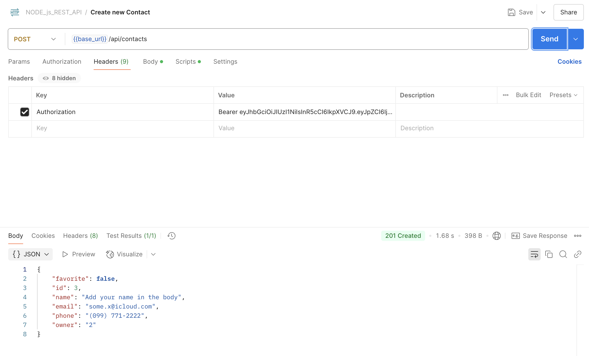
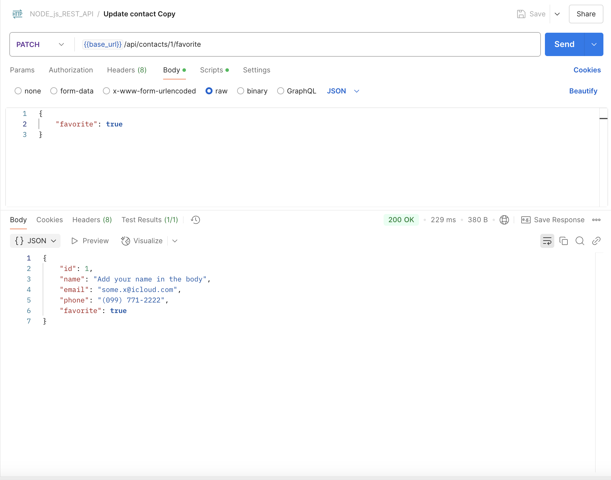
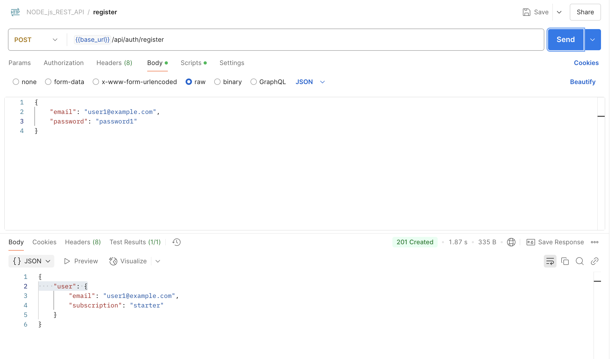
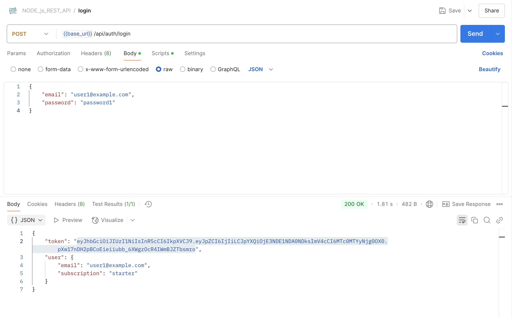
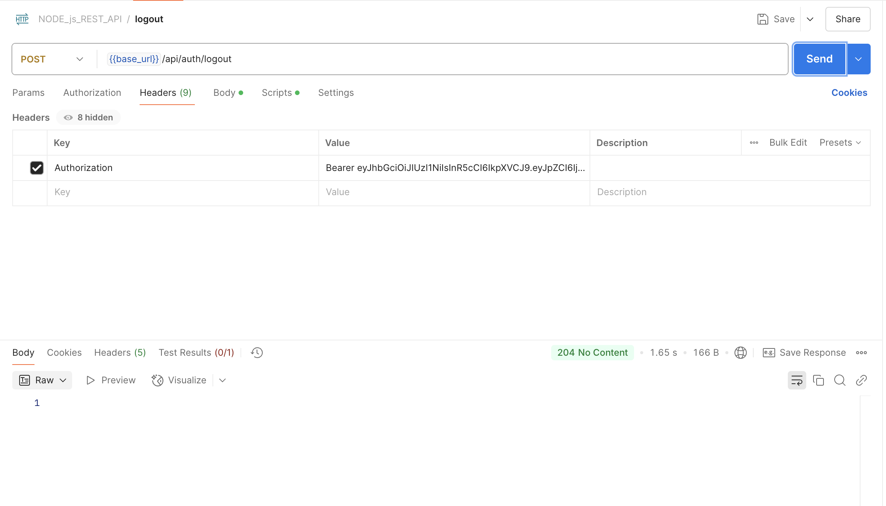
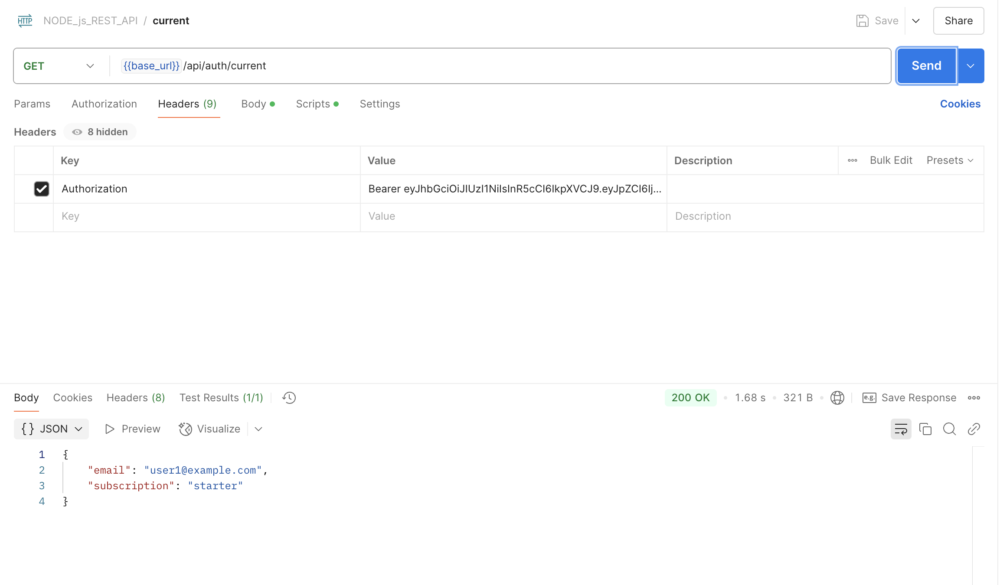

# goit-node-rest-api

### Fullstack. Back End Development: Node.js

### Master of degree from university

### HW02-Express REST API
#### Full List of contacts

#### Get contact by id

#### Add new contact

#### Remove contact

#### Update contact

### HW03-Express REST API
#### Update favorite status

#### HW04-Express Authorization
#### Register

#### Login

#### Logout

#### Current user
